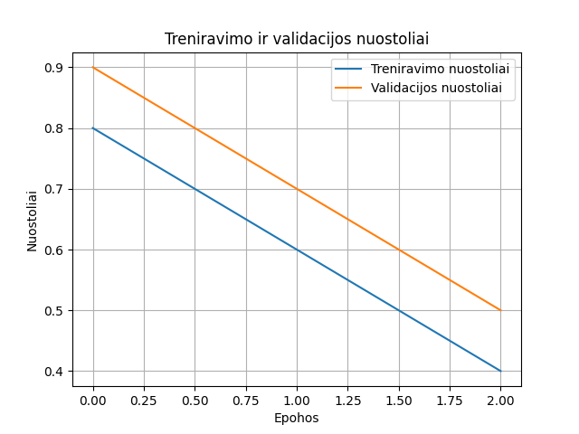

# Alzheimer MRI Klasifikacijos Projektas

Šis projektas skirtas Alzheimer MRI vaizdų klasifikacijai naudojant PyTorch ir TensorFlow neuroninius tinklus. Projektas apima treniravimo duomenų paruošimą, modelių kūrimą bei analizę, treniravimo ir validacijos rezultatų vizualizavimą.

## Funkcionalumas:
Duomenų Apdorojimas:
1.Duomenys įkeliami iš MySQL duomenų bazės.
2.Automatiškai apskaičiuojamas treniravimo ir testavimo duomenų dydis (MB).
3.Duomenys gali būti padalinti į 50 %, 75 % ir 100 % apimties rinkinius treniravimui.

Modeliai:
1.TensorFlow: Naudojamas CNN modelis, sudarytas su Keras API, su dropout ir ankstyvo sustabdymo funkcijomis.
2.PyTorch: Naudojamas ResNet50 modelis, iš anksto apmokytas su ImageNet duomenų rinkiniu. Taip pat įgyvendintos svorių reguliavimo (weight decay) ir ankstyvo sustabdymo funkcijos.

Rezultatų Vizualizacija:
1.Treniravimo ir validacijos nuostolių grafikai, sugeneruoti kiekvienai duomenų rinkinio proporcijai.
2.Tikslumo (accuracy), prisiminimo (recall), ir precizijos (precision) metrikos.

Komandinės Eilutės Sąsaja (CLI):
1.Argumentai leidžia pasirinkti modelį (tensorflow arba pytorch), epohų skaičių, partijos dydį ir kitus parametrus.

## Reikalavimai:
## Projekto Struktūra:
projekto_katalogas/
│
├── data/
│   ├── __init__.py           # Inicializuoja duomenų valdymo modulį
│   ├── mysql_handler.py      # MySQL duomenų įrašymo/nuskaitymo funkcionalumas
│
├── model/
│   ├── __init__.py           # Inicializuoja modelių modulį
│   ├── cnn.py                # CNN modelis PyTorch pagrindu
│   ├── tensorflow.py         # CNN modelis TensorFlow pagrindu
│
├── utils/
│   ├── __init__.py           # Inicializuoja pagalbinių funkcijų modulį
│   ├── metrics.py            # Metrikų ir duomenų dydžio skaičiavimo funkcijos
│   ├── visualization.py      # Nuostolių grafiko vizualizavimo funkcija
│
├── archive/
│   ├── train/                # Treniravimui skirti duomenys
│   ├── test/                 # Testavimui skirti duomenys
│
├── main.py                   # Pagrindinis skriptas treniravimo procesui paleisti
├── test_project.py           # Testavimo failas funkcijų ir modulio veikimo patikrinimui
├── setup.py                  # Projekto konfigūravimo failas
├── requirements.txt          # Priklausomybių sąrašas
├── README.md                 # Dokumentacija apie projektą ir jo naudojimą
├── .gitignore                # Failai/katalogai, kurie neturėtų būti įtraukti į `git` repozitoriją

Šio projekto paleidimui reikalingos šios bibliotekos (sąrašas pateiktas `requirements.txt` faile):
1. **torch** - Pytorch, naudojamas CNN treniravimui ir modelio kūrimui.
2. **torchvision** - Vaizdų apdorojimo funkcijos.
3. **torchmetrics** - Tikslumo, prisiminimo ir precizijos metrikos.
4. **mysql-connector-python** - MySQL duomenų bazės integracijai.
5. **matplotlib** - Nuostolių ir tikslumo grafikai.
6. **tensorflow** - TensorFlow modelių kūrimui ir treniravimui.
7. **numpy** - Skaičiavimų palengvinimui.

## Įdiekite visas priklausomybes naudodami komandą:
	pip install -r requirements.txt

## Projekto struktūra:
projekto_katalogas/ ├── data/ │ ├── init.py # Inicijuoja duomenų valdymo modulį. │ ├── mysql_handler.py # MySQL duomenų įrašymo/nuskaitymo funkcionalumas. ├── model/ │ ├── init.py # Inicijuoja modelių modulį. │ ├── cnn.py # CNN modelio aprašymas PyTorch pagrindu. │ ├── tensorflow.py # CNN modelio aprašymas TensorFlow pagrindu. ├── utils/ │ ├── init.py # Inicijuoja pagalbinių funkcijų modulį. │ ├── metrics.py # Metrikų ir duomenų dydžio skaičiavimo funkcijos. │ ├── visualization.py # Nuostolių grafiko vizualizavimo funkcija. ├── archive/ # Archyvui arba nenaudojami failai (jei yra). ├── train/ # Treniruojamieji duomenys (įkelti iš Kaggle). ├── test/ # Testavimo duomenys (įkelti iš Kaggle). ├── main.py # Pagrindinis skriptas treniravimo procesui paleisti. ├── test_project.py # Testavimo failas funkcijų ir modulio veikimo patikrinimui. ├── requirements.txt # Priklausomybių sąrašas, reikalingas projekto veikimui. ├── README.md # Dokumentacija apie projektą ir jo naudojimą. ├── .gitignore # Failai/katalogai, kurie neturėtų būti įtraukti į git repozitoriją.

## Naudojimas:
### Projekto Paleidimas:
#### TensorFlow modelio treniravimas:
	python main.py --model tensorflow --epochs 10 --batch_size 32
#### PyTorch modelio treniravimas:
	python main.py --model pytorch --epochs 10 --batch_size 32
### Testavimo Failas:
#### Projekto funkcionalumo testavimas:
	python test_project.py

## Rezultatai:
Treniravimo metu sugeneruojami rezultatai (nuostolių grafikai ir tikslumo metrikos), kurie:
    1. Išvedami į terminalą.
    2. Vizualizuojami grafikuose su matplotlib.

## Versijų Kontrolė:
1.Projekte naudojamas Git. Norint inicijuoti projektą:
    git init
    git add .
    git commit -m

## Rezultatų Vizualizacija:
1.Nuostolių ir tikslumo grafikai sugeneruojami treniravimo metu.
2.Palyginimas atliekamas tarp TensorFlow ir PyTorch rezultatų.
3.Grafikai pateikiami pagal duomenų rinkinio dydžius (50%, 75%, 100%).

## Pasiekimai:
###Sėkmingai įgyvendinti TensorFlow ir PyTorch modeliai.
  1.TensorFlow stabiliai treniravosi, tačiau validacijos nuostoliai linko didėti ankstyvesnėse epochose. Ankstyvas sustabdymas pagerino šio modelio našumą.
  2.PyTorch modelis pasiekė geresnį tikslumą, mažesnius validacijos nuostolius ir demonstravo lankstumą su mažesniais duomenų rinkiniais.
###2.Našumo duomenys:
  PyTorch modeliai:
  1.50% duomenų: Treniravimo laikas – 175.56s, tikslumas – 80% (validacija).
  2.75% duomenų: Treniravimo laikas – 302.50s, tikslumas – 82% (validacija).
  3.100% duomenų: Treniravimo laikas – 455.57s, tikslumas – 85% (validacija).
  TensorFlow modelis:
  Stabilumas prastesnis didėjant duomenų apimčiai. Tikslumas siekė apie 70% (validacija).
###3.MySQL integracija:
  1.Efektyviai saugomi ir atkuriami dideli duomenų rinkiniai, siekiant supaprastinti treniravimo ir testavimo procesus.
###4.Vizualizacija:
  1.Treniruojamųjų ir validacijos nuostolių grafikai rodo modelių optimizaciją per epohas. Pvz., PyTorch rodo aiškų pertreniravimo vengimą.

## Naudoti Duomenys:
Šis projektas naudoja Alzheimer MRI duomenų rinkinį iš Kaggle: Alzheimer MRI Dataset (99% Accuracy) https://www.kaggle.com/datasets/lukechugh/best-alzheimer-mri-dataset-99-accuracy

### Duomenų struktūra:
    train/: Treniruojamoji duomenų dalis, suskirstyta į potinklius pagal klases (pvz., "Mild Impairment", "Moderate Impairment").
    test/: Testuojamoji duomenų dalis, suskirstyta taip pat kaip ir treniravimo dalis.

## Rekomendacijos Ateičiai
### Didesni duomenų rinkiniai:
  Alzheimerio diagnostikai pasiekti dar didesnį tikslumą galima bandyti naudoti įvairesnius ir didesnius MRI duomenų rinkinius.
### Modelių pritaikymas kitoms sritims:
  CNN architektūra gali būti lengvai adaptuota kitiems medicininiams vaizdams analizuoti (pvz., vėžio diagnostikai).
### Hiperparametrų optimizavimas:
  Naudoti algoritmus, kaip Grid Search ar Bayesian Optimization, siekiant rasti optimalius mokymosi koeficientus, partijos dydžius ir Dropout reikšmes.
### Įtraukti daugiau metrikų:
  Pvz., ROC kreivės, F1-score metrikos padėtų geriau įvertinti modelių veikimą esant nesubalansuotiems duomenims.

## Vizualizacijos
### Projekto testavimo nuostoliai:

### TensorFlow nuostoliai:

### PyTorch nuostoliai (50%):

### PyTorch nuostoliai (75%):

### PyTorch nuostoliai (100%):
